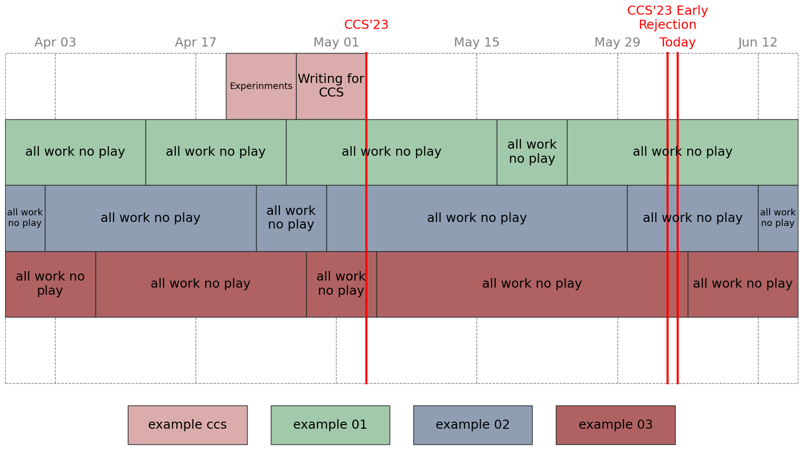

# README

Since Alfred loves timeline, this tool automatically generate timeline used for meetings, e.g. for the purpose of quarterly report.

## Example:
```bash
python timeline.py example
```

And find results in `example/out`.



## TODO
- [x] Define event format
- [x] Define config format
- [x] Draw in plt
    - [ ] Background tag
- [ ] Install